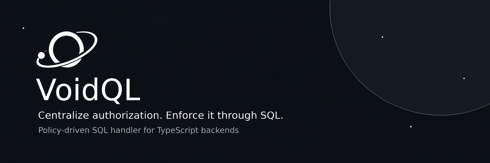
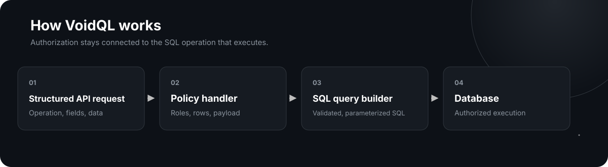

<div align="center">
  
</div>

<div align="center">
VoidQL is a policy-driven SQL handler for TypeScript backends. It brings role-based access, row and field permissions, payload validation, and workflow rules into one declarative policy layer.

Instead of scattering authorization checks across controllers, services, and query handlers, VoidQL evaluates the user, the requested operation, the existing data, and the incoming payload in one place—then applies the resulting constraints while building parameterized SQL operations.


[Try the Demo](https://demo.voidql.dev/) · [Explore the Wiki](../../wiki)

</div>

## 🚀 Get Started

Install VoidQL using npm:

```bash
npm install @voidql/core
```

## 🪐 Why VoidQL?

Authorization rarely remains a simple question of whether a user has a particular role. As applications grow, access decisions begin to depend on the operation, the records and fields involved, the existing data, the incoming payload, and the requested state transition.

These rules are often scattered across middleware, controllers, services, validators, and individual queries. Over time, they become duplicated, difficult to trace, and inconsistent with the database operations they are intended to protect.

VoidQL centralizes complex authorization in one declarative policy layer and applies those policies while building the corresponding SQL operation. This keeps authorization logic consistent, maintainable, and directly connected to the data operation that ultimately executes.

## ✦ Key Features

VoidQL centralizes authorization rules and applies them while building SQL operations. Its features cover the full flow—from determining whether an operation is permitted to controlling the query, validating the payload, and managing what happens before and after execution.

| Feature | What it provides |
| --- | --- |
| **Declarative Authorization DSL** | Define complex authorization policies through structured configuration using `AND`, `OR`, `IF / ELSE`, subqueries, `$user`, and `$data`. |
| **Role-Based Access Control (RBAC)** | Configure operations, fields, and row-level restrictions for each role. |
| **Payload-Aware Validation** | Validate incoming mutation data and conditionally restrict the specific change being requested. |
| **State-Transition Enforcement** | Control workflows and state changes using existing data, payload values, and user context. |
| **Dynamic Query Builder** | Build validated SQL operations from structured definitions, including joins, filters, ordering, and grouping. |
| **Row-Level Enforcement in SQL** | Compile authorization constraints directly into SQL conditions, without post-query or in-memory filtering. |
| **Field-Level Control** | Control which fields can be selected, inserted, updated, deleted, or returned. |
| **Before and After Triggers** | Transform data, run additional queries, and execute user-defined functions around an operation. |
| **Bulk Inserts** | Insert multiple records while applying the relevant authorization and validation policies. |

### 1. Declarative Authorization DSL

Define authorization policies using structured JSON instead of imperative code.

Supports:

- `AND` and `OR` conditions
- Conditional `IF / ELSE` logic
- Subqueries
- Session variables (`$user`)
- Payload references (`$data`)

This keeps authorization rules centralized, explicit, and easier to review and maintain.

### 2. Role-Based Access Control (RBAC)

Define permissions for each role and operation:

```ts
{
  type: "PUT",
  user: {
    allowed: { ... },
    disallowed: [...]
  },
  admin: ALL,
  guest: NONE
}
```

Roles can define:

- Allowed fields
- Disallowed fields
- Row-level constraints
- Operation restrictions

Role-based permissions can be combined with field-level, row-level, payload-aware, and workflow conditions within the same policy model.

### 3. Payload-Aware Validation

Validate not only who is performing an operation, but also the data they are attempting to insert or modify:

```ts
if: {
  when: {
    left_value: "$data.table.field",
    operator: "IS NOT",
    value: null
  },
  do: where_condition,
  else: other_where_condition
}
```

This enables rules such as:

- Validating incoming values
- Comparing proposed values with existing data
- Restricting specific changes conditionally
- Allowing or rejecting an operation based on its payload

### 4. State-Transition Enforcement

Control whether a requested state change is valid before building the corresponding SQL operation.

VoidQL can evaluate:

- Existing row values
- Incoming mutation payload
- User and session data
- Fields included in the mutation's `WHERE` conditions

Common use cases include:

- Workflow progression validation
- Approval chains
- Status-change restrictions
- Business-rule enforcement

### 5. Dynamic Query Builder

Build SQL operations from structured query definitions:

```ts
{
  table: "orders",
  type: "GET",
  select: [
    "orders.*",
    "users.email"
  ],
  join: [
    {
      table: "users",
      on: { "orders.user_id": "users.id" },
      type: "INNER"
    }
  ]
}
```

VoidQL generates the corresponding SQL:

```sql
SELECT orders.*, users.email
FROM orders
INNER JOIN users
  ON orders.user_id = users.id
```

The query builder supports joins, filters, subqueries, ordering, grouping, and structured read and mutation operations.

Requested fields, joins, and conditions are validated against the applicable policies before being included in the generated SQL operation.

### 6. Row-Level Enforcement in SQL

Compile row-level authorization constraints directly into SQL `WHERE` clauses, joins, and related query conditions.

This means:

- No post-query authorization filtering
- No in-memory removal of unauthorized records
- No separate row-authorization step after retrieval
- Authorization remains connected to the generated SQL operation

The resulting query targets only the rows permitted by the applicable policy, reducing the risk of authorization rules diverging from the executed operation.

### 7. Field-Level Control

Define which fields can participate in each operation, based on the role and operation type.

Fields can be controlled when they are:

- Selected
- Inserted
- Updated
- Returned

```ts
allowed: {
  field: ["type", "hours_worked"],
  where: { ... }
},
disallowed: ["id", "user_id"]
```

This prevents unauthorized fields from being read or submitted while allowing different roles to access different parts of the same record.

## ⚖️ Comparison with Other Approaches

VoidQL combines authorization, payload validation, workflow rules, and SQL construction within the same declarative flow.

- Unlike **application-level checks**, it centralizes policies instead of distributing them across middleware, controllers, and services.
- Unlike **database-native RLS**, it works directly with application context, incoming payloads, and structured query definitions.
- Unlike **GraphQL engines**, it integrates into an existing TypeScript backend without requiring a generated GraphQL API layer.

### Comparison with GraphQL Engines

| Capability | VoidQL | Typical GraphQL Engine |
| --- | --- | --- |
| **Payload-aware rules** | ✅ Rules can directly evaluate the incoming payload | ❌ Not supported as part of the standard permission model |
| **State transition checks** | ✅ Validates changes by comparing existing and proposed values | ❌ Usually requires additional application logic |
| **Conditional `IF` logic** | ✅ Built directly into the authorization DSL | ❌ Not available as an explicit permission construct |
| **Dynamic joins** | ✅ Joins can be defined dynamically within structured requests | Limited — primarily based on predefined schema relationships |
| **SQL-level enforcement** | ✅ Authorization rules are compiled into the generated SQL | ✅ Permission rules are enforced through database queries |
| **GUI / metadata tooling** | ⚠️ Coming in a future SaaS offering | ✅ Typically available through a management console |

## 🎯 Use Cases

VoidQL is a good fit for TypeScript backends where authorization depends on roles, data, incoming payloads, or workflow state.

Common use cases include:

- **Multi-tenant and multi-role SaaS applications** — Restrict access by organization, workspace, account, and user role
- **Approval workflows** — Enforce transitions such as `draft → submitted → approved`
- **Order and payment systems** — Control cancellations, refunds, and status changes
- **Internal business tools** — Apply different row, field, and operation permissions across teams
- **User-owned resources** — Limit users to their own data while allowing broader administrator access
- **Dynamic data APIs** — Build authorized SQL operations with joins, filters, ordering, and grouping

## 🚀 VoidQL in Action

### Request Structure

VoidQL accepts a `Request` object that describes the database operation or sequence of operations to execute.

#### Request type

A request can be either:

- A single `StructuredQuery`
- A sequence of query phases: `{ phases: QueryPhase[] }`

A phase is defined as:

```ts
export type QueryPhase = {
  mode: "QUERY" | "TRANSACTION";
  queries: StructuredQuery[];
};
```

- `QUERY` runs each query independently, outside a shared transaction, and returns all results.
- `TRANSACTION` runs all queries in the phase within a single database transaction, so they succeed or fail together.

#### `StructuredQuery` shape

```ts
export type StructuredQuery = {
  table: keyof Structure;
  type: "GET" | "PUT" | "POST" | "DELETE";
  select?: string[] | string;
  join?: Join[];
  where?: WhereCondition;
  data?: Record<string, any> | Record<string, any>[];
  group_by?: string[] | string;
  order_by?: string[] | string;
  returning?: string[] | string;
  limit?: number;
};
```

Field meanings:

- `table` — the name of the table in the structure schema.
- `type` — the HTTP-like operation used to select the applicable endpoint and authorization definition.
- `select` — columns or expressions to return for `GET` requests.
- `join` — join definitions to include related tables.
- `where` — conditions used to filter the rows targeted by the operation and apply row-level constraints.
- `data` — payload for `PUT`, `POST`, or mutation requests. It can contain a single record or an array of records.
- `group_by` / `order_by` — grouping and ordering controls.
- `returning` — columns to return after mutating rows.
- `limit` — maximum number of rows to affect or return, depending on the operation.

#### Join definition

```ts
export type Join = {
  table: keyof Structure;
  type: "INNER" | "LEFT";
  on: Record<string, string> | WhereCondition;
};
```

The `on` clause can be either a simple column mapping, such as:

```ts
{ "guest_code.user_id": "users.id" }
```

or a more complex `WhereCondition`.

#### Where condition types

VoidQL supports rich condition expressions.

##### Simple conditions

```ts
{
  field: "status",
  operator: "=",
  value: "active"
}
```

Supported operators include:

- `=`, `!=`, `<`, `<=`, `>`, `>=`
- `LIKE`, `NOT LIKE`, `ILIKE`, `NOT ILIKE`
- `IS`, `IS NOT`, `IS NULL`, `IS NOT NULL`
- `IN`, `NOT IN`, `BETWEEN`, `NOT BETWEEN`

##### Nested logic

```ts
{
  and: [
    { field: "role", operator: "=", value: "admin" },
    {
      or: [
        { field: "status", operator: "=", value: "pending" },
        { field: "status", operator: "=", value: "approved" }
      ]
    }
  ]
}
```

##### Conditional `IF`

```ts
{
  if: {
    when: { field: "priority", operator: ">", value: 5 },
    do: { field: "approved", operator: "=", value: true },
    else: { field: "approved", operator: "=", value: false }
  }
}
```

##### `EXISTS` / `NOT EXISTS`

```ts
{
  operator: "EXISTS",
  query: {
    select: "id",
    from: "approvals",
    where: {
      field: "approvals.request_id",
      operator: "=",
      value: { left_value: "id" }
    }
  }
}
```

##### Subquery `IN`

```ts
{
  field: "user_id",
  operator: "IN",
  value: {
    select: "id",
    from: "users",
    where: { field: "active", operator: "=", value: true }
  }
}
```

### Example: Single `GET` Request

```ts
{
  table: "guest_code",
  type: "GET",
  select: ["guest_code.*", "users.email"],
  join: [
    {
      table: "users",
      type: "INNER",
      on: { "guest_code.user_id": "users.id" }
    }
  ],
  where: {
    field: "guest_code.active",
    operator: "=",
    value: true
  },
  order_by: ["guest_code.created_at DESC"],
  limit: 50
}
```

### Example: Transaction Request

```ts
{
  phases: [
    {
      mode: "TRANSACTION",
      queries: [
        {
          table: "orders",
          type: "POST",
          data: { customer_id: 123, total: 49.99 }
        },
        {
          table: "inventory",
          type: "PUT",
          data: [{ id: 456, stock: 10 }]
        }
      ]
    }
  ]
}
```

## 🧪 Interactive Playground

Experiment with VoidQL directly in your browser.

Use the playground to:

- Build structured requests
- Define authorization policies
- Test roles, session data, and payloads
- Preview the generated SQL
- Inspect allowed and denied operations

**[Open the Interactive Playground →](https://demo.voidql.dev/)**

## ⚙️ Architecture

<div align="center">
  
</div>

The handler:

1. Parses the structured request.
2. Applies role-based policies.
3. Injects row-level conditions.
4. Validates payload constraints.
5. Generates the final SQL query.
6. Executes the query safely.

## 🔒 Security Model

- Database operations handled by VoidQL are compiled through policy rules.
- Field access is explicitly controlled.
- Row filters are injected at SQL level.
- Payload comparisons enforce configured state-transition rules.

Security relies on all database access going through the VoidQL handler, with no raw SQL or direct database access bypass routes.

## 🗺️ Project Status and Roadmap

VoidQL is currently under active development.

- **Runtime:** `[supported runtime]`
- **Language:** TypeScript
- **Database:** `[supported database]`
- **Integration:** Designed for existing TypeScript backends
- **Status:** Experimental — APIs and configuration may change before a stable release

VoidQL currently supports policy-driven SQL generation, role- and field-level permissions, payload-aware validation, workflow rules, dynamic joins, triggers, and bulk operations.

### Future Direction

VoidQL will evolve into a SaaS platform with:

- Policy management interface
- API integration tooling
- Authorization visualization
- Query and rule debugging tools
- Real-time policy editing without the need to restart

The planned subscription model includes:

- A free tier for experimentation
- Developer plans for startups and indie builders
- Advanced plans for production SaaS applications

**Open-source code:** VoidQL is fully open source and self-hostable. Users may modify and host the project freely.

### Current Limitations

- **Database:** `Triggers and returning`

## 📚 Documentation and Wiki

For detailed guides, configuration references, and advanced examples, visit the [VoidQL Wiki](../../wiki).

The documentation includes:

- Installation and setup
- Request and policy configuration
- Authorization and validation rules
- Triggers and transactions
- API reference
- Advanced examples and troubleshooting

## 💬 Community and Feedback

We welcome feedback on:

- Architecture decisions
- Policy DSL design
- Real-world use cases
- Missing features and improvement ideas

Share your feedback through [GitHub Discussions](../../discussions) or report issues through [GitHub Issues](../../issues). Your input will help shape VoidQL's future development.

## 👥 Who We Are

We are a team of three:

- Two software engineers specializing in backend architecture, database systems, and API infrastructure
- One commercial specialist focused on product strategy, business development, and market positioning

Together, we aim to simplify complex backend challenges by building solutions that are secure, scalable, and easy to integrate. 

## 📄 License

VoidQL is released under the [MIT License](LICENSE). It is fully open source and may be used, modified, and self-hosted in accordance with the license terms.
